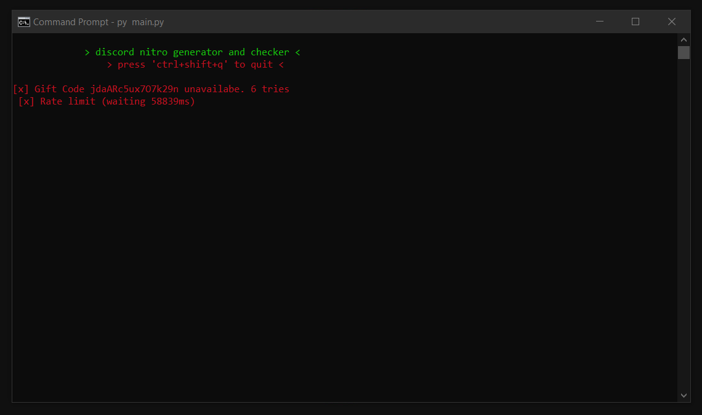

# Discord Nitro generator
Simple Python script that generates and checks if the generated gift code is available.

## Note
This script is relatively slow because it makes a request to Discord's API to check if they work.

The average time is 6 codes per minute

## Requirements
``pip install -r requirements.txt``

(If you are willing to use the compiled version you do not need to install these requirements)

## Usage
You can either use the [binary version available](https://github.com/pedrokpp/nitro-generator/releases/download/1.0/gen.exe) at the releases tab or just by downloading the python version and then doing ``py main.py``

After that you should just wait, since this is a long time investment

## Attention
You should not spam this since your IP could be in trouble because of the API requests. I don't have anything to do if you get banned or worse.

**Use it carefully and with moderation**
